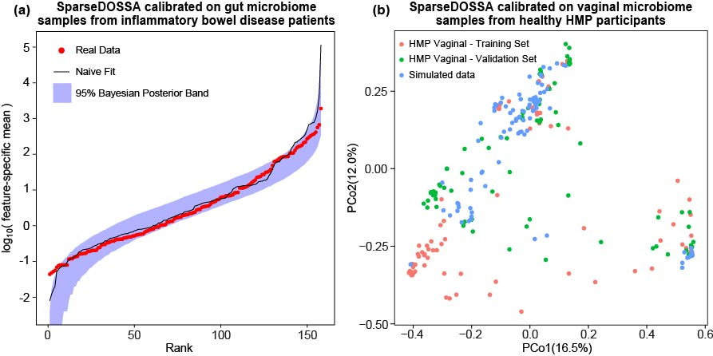
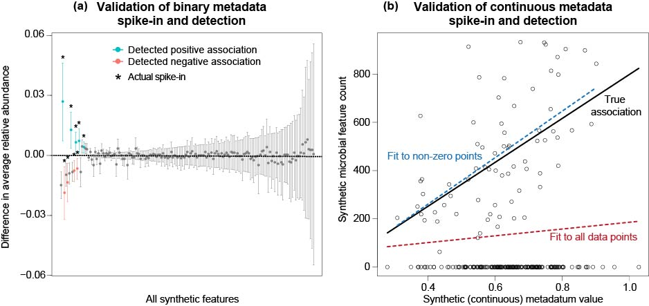
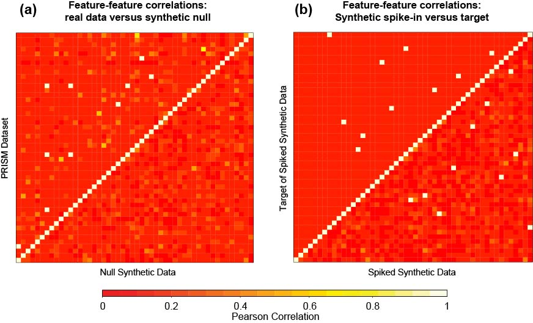
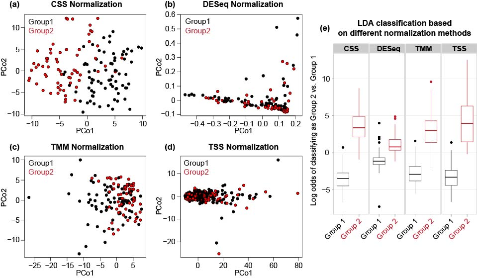
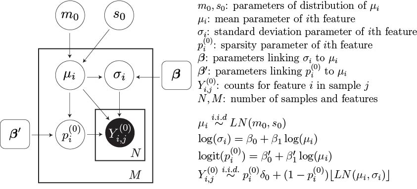

## Introduction

Metagenomic  sequencing  provides  a  practical  and  broadly  applicable 
means  for describing  host-  and  environmentally-associated  microbial 
communities. Several  statistical methods  have  been  developed  to 
facilitate  analysis of  community  profiles, but  due  to  the complex 
nature  of  typical  microbiome  measurements  (e.g.  sparse, 
zero-inflated  sequence counts  or  compositions)  and  of  the  associated
 underlying  biology,  it  is  typically  difficult  to compare, 
benchmark, or  evaluate  these  methods  within a  single  systematic
framework. To address  this  challenge,  we  present  sparseDOSSA  (Sparse 
Data  Observations  for  the Simulation of Synthetic Abundances): a
Bayesian hierarchical model of microbial ecological population  structure. 

sparseDOSSA's model captures the marginal distribution of each microbial
feature as a truncated, zero-inflated log-normal distribution, with
parameters distributed as a parent log-normal distribution. The model can
be effectively fit to reference microbial datasets in order to parameterize
their microbes and communities, or to simulate synthetic datasets of
similar population structure. Most importantly, it allows users to include
both known feature-feature and feature-metadata correlation structures and
thus provides a gold standard to enable benchmarking of statistical methods
for metagenomic data analysis.

The output of sparseDOSSA can be used to help researchers characterize
statistical packages in Bioconductor for metagenomic data analysis in terms
of their statistical power under different settings of the microbiome data
(e.g. sample size, library size, correlation strength, etc). Based on the
characterization, researchers can design their experiments and decide which
statistical tools to use to maximize the chance of detecting signals in the
data. As an example, in the later section about applications of
sparseDOSSA, we tried to replicate the benchmark results of Bioconductor
package `metagenomeSeq` in its original paper [@paulson] and confirmed the
optimal performance of its cumulative sum scaling (CSS) method comparing to
other normalization methods in terms of detecting a binary clustering
structure in the data.

## How To Run

### Loading
We first need to load the package:
```{r load, eval=TRUE, warning=FALSE, results="hide"}
library(sparseDOSSA)
```

### Package Features
The sparseDOSSA package contains a single function:

* `sparseDOSSA`, a wrapper for running all functionality of sparseDOSSA.

### Data and Prior Input 
For a full and complete description of the possible parameters for
`sparseDOSSA`, their default values, and the output, see

```{r run-sparsedossa-help, eval=TRUE, warning=FALSE, message=FALSE, results="hide"} 
?sparseDOSSA 
```

#### Required Input
There is no required input for running sparseDOSSA. By default, sparseDOSSA
will produce a single microbial community data with 20 randomly generated
metadata and no microbe-metadata correlation or microbe-microbe
correlation. There will be 300 microbes and 50 samples and the read-depth
for each sample is 8030. The template for this dataset is the PRISM dataset
[@xochi2012]. The sample code is as following:

```{r default-run, eval=TRUE, cache=TRUE, warning=FALSE, message=FALSE, results="hide"}
sparseDOSSA::sparseDOSSA()
```


#### Community property parameters
The community property parameters can be specified as input. They are the
calibration file (the template microbiome dataset sparseDOSSA will train
its model on), the number of microbes, the number of samples, read depth,
the number of metadata for each different types, and the number of datasets
it generates (only turned on when simulating microbe-microbe associations).
If you have your own calibration dataset and would like to simulate data
based on it, please follow the example below. Your dataset must be in a
QIIME OTU table format, that is taxonomic units in rows and samples in
columns, with each cell indicates the observed counts. For example,

```{r input-community, eval=TRUE, cache=TRUE, warning=FALSE, message=FALSE, results="hide"}
n.microbes <- 150
n.samples <- 50
n.metadata <- 2
sparseDOSSA::sparseDOSSA( number_features = n.microbes, 
                          number_samples = n.samples, 
                          number_metadata = n.metadata )
```

### Microbe-Metadata correlation
There are several options to introduce correlation between the simulated
metadata and microbes' abundances. We use a linear model to spike in
correlations and the abundances of microbes are treated as the outcomes for
the linear model. These options include the proportion of microbes that are
made correlated with the metadata, the value of the regression coefficients
in the linear model and how many metadata are used for the linear model.

```{r bugmeta, eval=TRUE, cache=TRUE, warning=FALSE, message=FALSE, results="hide"}
sparseDOSSA::sparseDOSSA( spikeStrength = "2.0", spikeCount = "2" )
```

### Microbe-Microbe correlation
sparseDOSSA can also introduce correlations between microbes. This is
achieved through a multivariate-lognormal model considered in
[BAnOCC](https://bitbucket.org/biobakery/banocc). A compound symmetric
correlation matrix is used to describe the correlation structure for the
chosen set of microbes. The options for microbe-microbe correlation
structure include the value of off-diagonal elements of the correlation
matrix, and a path to the spike file that indicates which pairs of microbes
are correlated (alternatively, you can only specify how many microbes are
inter-correlated and those microbes will be chosen randomly). Most
importantly, if you want to simulate community with microbe-microbe
correlations, you need to set the flag `runBugBug` to TRUE.

```{r bugbug, eval=TRUE, cache=TRUE, warning=FALSE, message=FALSE, results="hide"}
sparseDOSSA::sparseDOSSA( runBugBug = TRUE, bugBugCorr = "0.2",
bugs_to_spike = 5 )
```

### Output Control
For each simulation using default model parameters, sparseDOSSA will
produce three txt files: `SyntheticMicrobiome.pcl`,
`SyntheticMicrobiome-Counts.pcl`, `SyntheticMicrobiomeParameterFile.txt`.
The first two files contain the actual microbiome abundance data and the
third file records values of model parameters, diagnostic information and
spike-in assignment. You can specify the names of these files as well as
the directory you want to put them to.

```{r output, eval=TRUE, cache=TRUE, warning=FALSE, message=FALSE, results="hide"}
sparseDOSSA::sparseDOSSA( strNormalizedFileName = "my_Microbiome.pcl",
    strCountFileName = "my_Microbiome-Counts.pcl",
    parameter_filename = "my_MicrobiomeParameterFile.txt" )
```

## Several applications of sparseDOSSA

### Simulated community without correlations
sparseDOSSA's hierarchical model is calibrated using the [PRISM
dataset](https://www.dropbox.com/s/akgv0bv8bbpzcqo/prism.tsv?dl=0) by
default. Here is a basic example of simulating dataset with 150 features
(microbes), 180 samples and 10 metadata for each type (binary, quaternary
and continuous), without any correlation structure. We use the default
values for other model parameters:
```{r PRISM, eval=FALSE, cache=TRUE, results="hide"}
n.microbes <- 150
n.samples <- 180
n.metadata <- 10
n.dataset <- 1
sparseDOSSA::sparseDOSSA( number_features = n.microbes, 
                          number_samples = n.samples, 
                          number_metadata = n.metadata, 
                          datasetCount = n.dataset )
```

The data for the resulting community can be downloaded
[here](https://www.dropbox.com/s/aj8dmxd2oq2dms2/third_example.pcl?dl=0).
We can find the simulated community is very similar to the original PRISM
dataset. We plotted the distribution of rank abundances and a PCoA plot
with simulated data and template data to illustrate this:



### Simulated community with microbe-metadata correlation and microbe-microbe correlation
If we want to add feature-metadata correlation, with 2% of the features
spiked and each spiked feature correlated with one randomly selected
metadata, we can use:

```{r PRISM-bm, eval=FALSE, cache=TRUE, results="hide"}
n.microbes <- 150
n.samples <- 180
n.metadata <- 10
n.dataset <- 1
spike.perc <- 0.02
sparseDOSSA::sparseDOSSA( number_features = n.microbes, 
                          number_samples = n.samples, 
                          number_metadata = n.metadata, 
                          datasetCount = n.dataset, 
                          percent_spiked =spike.perc  )
```

The result of this run can be found
[here](https://www.dropbox.com/s/l2lncawr7cwlqnc/second_example.pcl?dl=0).
As an example, we visualize the spiked dataset with a binary metadatum and
a continuous metadatum:



You can also simulate dataset with feature-feature correlation only. Assume
each spiked feature is correlated with two other randomly selected features
and 10 randomly selected features are spiked:

```{r PRISM-bb, eval=FALSE, cache=TRUE, results="hide"}
n.microbes <- 150
n.samples <- 180
n.metadata <- 10
n.dataset <- 1
n.corr <- 10
sparseDOSSA::sparseDOSSA( number_features = n.microbes, 
                          number_samples = n.samples, 
                          number_metadata = n.metadata, 
                          datasetCount = n.dataset, 
                          bugs_to_spike = n.corr, 
                          runBugBug = TRUE  )
```

The results can be found
[here](https://www.dropbox.com/s/r36pws7udpamwqp/third_example.pcl?dl=0).
We also visualize the resulting dataset to verify the correlation is indeed
introduced:



### Benchmarking metagenomeSeq
As an final example to show sparseDOSSA can replicate results in previous
literature, we choose to benchmark CSS normalization introduced in
metagenomeSeq [@paulson]. We use their testing dataset to calibrate our
model and introduce binary association to emulate the cluster structure
present in the original dataset. In the paper, they ran their model on a
dataset published in a diet study for mice [@mice]. The mice dataset can be
found [here](https://www.dropbox.com/s/e1jlinzqnkyyrh5/mouse_raw.pcl?dl=0).
Assume the data file is $mice.txt$, the code we run to get the synthetic
data with known differential abundance profile is

```{r Metagenomeseq, eval=FALSE, cache=TRUE, results="hide"}
sparseDOSSA::sparseDOSSA( calibrate = "mice.txt", number_metadata = 1,
percent_spiked = 0.2 )
```

The simulation result can be downloaded
[here](https://www.dropbox.com/s/woq8382qh00fqol/mouse_sim.pcl?dl=0). We
performed the same analyses as in Paulson et al and the results are shown
below. We can see the results are very similar to those findings in the
original paper.



## The Model
We introduced a hierarchical model to jointly describe the distribution
characteristics of microbes. We first assume the distribution of each
microbes across samples is rounded and zero-inflated lognormal. The mean
and standard deviation parameters are linked through a linear relationship
and the mean parameters across all microbes follow a lognormal
distribution. The sparsity is linked with the marginal mean parameters as
well. The relationship is described by a logistic model. The details can
be found in the following plate diagram:



## References
