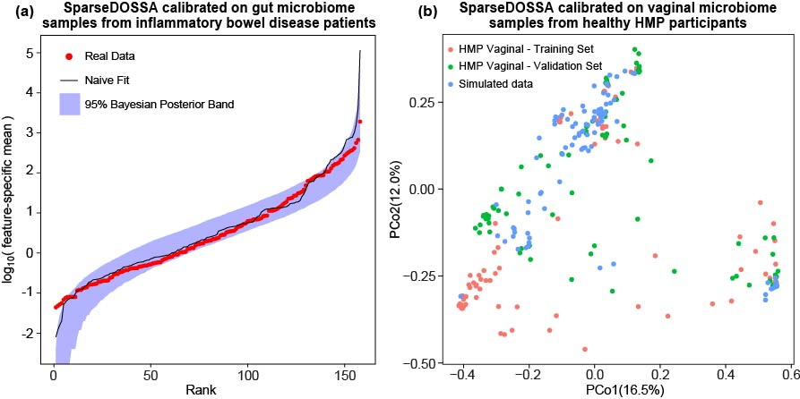
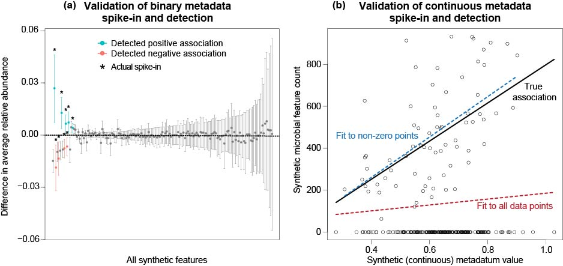
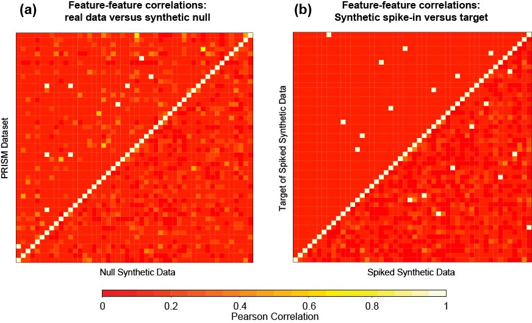
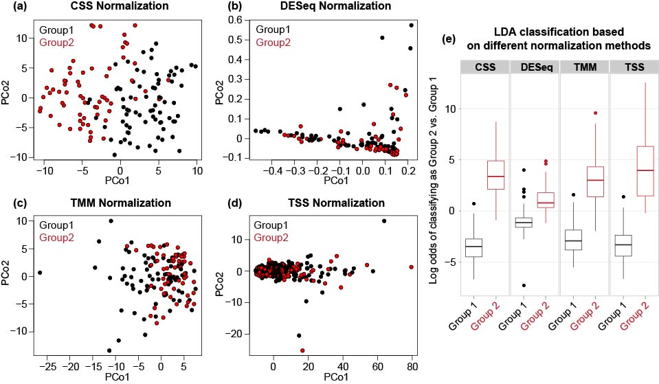
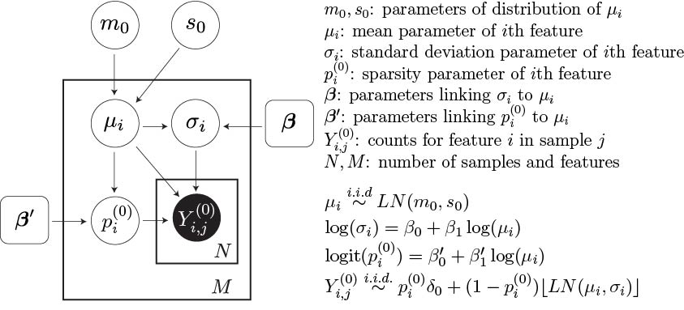

Sparse Data Observations for the Simulation of Synthetic Abundances (SparseDOSSA)
================
Boyu Ren
2016-10-10

-   [Introduction](#introduction)
-   [How To Install](#how-to-install)
    -   [From Within R](#from-within-r)
    -   [From Bitbucket (Compressed File)](#from-bitbucket-compressed-file)
    -   [From Bitbucket (Directly)](#from-bitbucket-directly)
-   [How To Run](#how-to-run)
    -   [Loading](#loading)
    -   [Package Features](#package-features)
    -   [Data and Prior Input](#data-and-prior-input)
        -   [Required Input](#required-input)
        -   [Community property parameters](#community-property-parameters)
    -   [Microbe-Metadata correlation](#microbe-metadata-correlation)
    -   [Microbe-Microbe correlation](#microbe-microbe-correlation)
    -   [Output Control](#output-control)
-   [Several applications of SparseDOSSA](#several-applications-of-sparsedossa)
    -   [Simulated community without correlations](#simulated-community-without-correlations)
    -   [Simulated community with microbe-metadata correlation and microbe-microbe correlation](#simulated-community-with-microbe-metadata-correlation-and-microbe-microbe-correlation)
    -   [Benchmarking metagenomeSeq](#benchmarking-metagenomeseq)
-   [The Model](#the-model)
-   [References](#references)

Introduction
------------

Metagenomic sequencing provides a practical and broadly applicable means for describing host- and environmentally-associated microbial communities. Several statistical methods have been developed to facilitate analysis of community profiles, but due to the complex nature of typical microbiome measurements (e.g. sparse, zero-inflated sequence counts or compositions) and of the associated underlying biology, it is typically difficult to compare, benchmark, or evaluate these methods within a single systematic framework. To address this challenge, we present SparseDOSSA (Sparse Data Observations for the Simulation of Synthetic Abundances): a Bayesian hierarchical model of microbial ecological population structure.

SparseDOSSA's model captures the marginal distribution of each microbial feature as a truncated, zero-inflated log-normal distribution, with parameters distributed as a parent log-normal distribution. The model can be effectively fit to reference microbial datasets in order to parameterize their microbes and communities, or to simulate synthetic datasets of similar population structure. Most importantly, it allows users to include both known feature-feature and feature-metadata correlation structures and thus provides a gold standard to enable benchmarking of statistical methods for metagenomic data analysis.

How To Install
--------------

There are three options for installing SparseDOSSA:

-   Within R
-   Using compressed file from BitBucket
-   Directly from BitBucket

### From Within R

**This is not yet available**

### From Bitbucket (Compressed File)

**This is not yet available**

### From Bitbucket (Directly)

Clone the repository using `git clone`, which downloads the package as its own directory called `sparseDOSSA`.

``` bash
git clone https://<your-user-name>@bitbucket.org/biobakery/sparsedossa.git
```

Then, install SparseDOSSA's dependencies. If these are already installed on your machine, this step can be skipped.

``` bash
Rscript -e "install.packages(c('optparse', 'tmvtnorm'))"
```

Lastly, in the same directory where the folder `sparseDOSSA` is located, install SparseDOSSA using `R CMD INSTALL`. Note that this *will not* automatically install the dependencies, so they must be installed first.

``` bash
R CMD INSTALL sparseDOSSA
```

How To Run
----------

### Loading

We first need to load the package:

``` r
library(sparseDOSSA)
```

### Package Features

The SparseDOSSA package contains a single function:

-   `sparseDOSSA`, a wrapper for running all functionality of SparseDOSSA.

### Data and Prior Input

For a full and complete description of the possible parameters for `sparseDOSSA`, their default values, and the output, see

``` r
?sparseDOSSA 
```

#### Required Input

There is no required input for running SparseDOSSA. By default, SparseDOSSA will produce a single microbial community data with 20 randomly generated metadata and no microbe-metadata correlation or microbe-microbe correlation. There will be 300 microbes and 50 samples and the read-depth for each sample is 8030. The template for this dataset is the PRISM dataset (Morgan et al. 2012). The sample code is as following:

``` r
sparseDOSSA::sparseDOSSA()
```

    ## Warning in sparseDOSSA::sparseDOSSA(): number of associations = 0, and no
    ## spike file specified; no bug-bug spike-ins will be done.

#### Community property parameters

The community property parameters can be specified as input. They are the calibration file (the template microbiome dataset SparseDOSSA will train its model on), the number of microbes, the number of samples, read depth, the number of metadata for each different types, and the number of datasets it generates (only turned on when simulating microbe-microbe associations). If you have your own calibration dataset and would like to simulate data based on it, please follow the example below. Your dataset must be in a QIIME OTU table format, that is taxonomic units in rows and samples in columns, with each cell indicates the observed counts. For example,

``` r
n.microbes <- 150
n.samples <- 50
n.metadata <- 1
sparseDOSSA::sparseDOSSA( number_features = n.microbes, 
                          number_samples = n.samples, 
                          number_metadata = n.metadata )
```

    ## Warning in sparseDOSSA::sparseDOSSA(number_features = n.microbes,
    ## number_samples = n.samples, : number of associations = 0, and no spike file
    ## specified; no bug-bug spike-ins will be done.

### Microbe-Metadata correlation

There are several options to introduce correlation between the simulated metadata and microbes' abundances. We use a linear model to spike in correlations and the abundances of microbes are treated as the outcomes for the linear model. These options include the proportion of microbes that are made correlated with the metadata, the value of the regression coefficients in the linear model and how many metadata are used for the linear model.

``` r
sparseDOSSA::sparseDOSSA( spikeStrength = "2.0", spikeCount = "2" )
```

    ## Warning in sparseDOSSA::sparseDOSSA(spikeStrength = "2.0", spikeCount =
    ## "2"): number of associations = 0, and no spike file specified; no bug-bug
    ## spike-ins will be done.

### Microbe-Microbe correlation

SparseDOSSA can also introduce correlations between microbes. This is acheived through a multivariate-lognormal model considered in [BAnOCC](https://bitbucket.org/biobakery/banocc). A compound symmetric correlation matrix is used to describe the correlation structure for the chosen set of microbes. The options for microbe-microbe correlation structure include the value of off-diagonal elements of the correlation matrix, and a path to the spike file that indicates which pairs of microbes are correlated (alternatively, you can only specify how many microbes are inter-correlated and those microbes will be chosen randomly). Most importantly, if you want to simulate community with microbe-microbe correlations, you need to set the flag `runBugBug` to TRUE.

``` r
sparseDOSSA::sparseDOSSA( runBugBug = TRUE, bugBugCorr = "0.2", bugs_to_spike = 5 )
```

### Output Control

For each simulation using default model parameters, SparseDOSSA will produce three txt files: `SyntheticMicrobiome.pcl`, `SyntheticMicrobiome-Counts.pcl`, `SyntheticMicrobiomeParameterFile.txt`. The first two files contain the actual microbiome abundance data and the third file records values of model parameters, diagnostic information and spike-in assignment. You can specify the names of these files as well as the directory you want to put them to.

``` r
sparseDOSSA::sparseDOSSA( strNormalizedFileName = "my_Microbiome.pcl",
    strCountFileName = "my_Microbiome-Counts.pcl",
    parameter_filename = "my_MicrobiomeParameterFile.txt" )
```

    ## Warning in sparseDOSSA::sparseDOSSA(strNormalizedFileName =
    ## "my_Microbiome.pcl", : number of associations = 0, and no spike file
    ## specified; no bug-bug spike-ins will be done.

Several applications of SparseDOSSA
-----------------------------------

### Simulated community without correlations

SparseDOSSA's hierarchical model is calibrated using the [PRISM dataset](https://www.dropbox.com/s/akgv0bv8bbpzcqo/prism.tsv?dl=0) by default. Here is a basic example of simulating dataset with 150 features (microbes), 180 samples and 10 metadata for each type (binary, quaternary and continuous), without any correlation structure. We use the default values for other model parameters:

``` r
n.microbes <- 150
n.samples <- 180
n.metadata <- 10
n.dataset <- 1
sparseDOSSA::sparseDOSSA( number_features = n.microbes, 
                          number_samples = n.samples, 
                          number_metadata = n.metadata, 
                          datasetCount = n.dataset )
```

The data for the resulting community can be downloaded [here](https://www.dropbox.com/s/aj8dmxd2oq2dms2/third_example.pcl?dl=0). We can find the simulated community is very similar to the original PRISM dataset. We plotted the distribution of rank abundances and a PCoA plot with simulated data and template data to illustrate this:



### Simulated community with microbe-metadata correlation and microbe-microbe correlation

If we want to add feature-metadata correlation, with 2% of the features spiked and each spiked feature correlated with one randomly selected metadata, we can use:

``` r
n.microbes <- 150
n.samples <- 180
n.metadata <- 10
n.dataset <- 1
spike.perc <- 0.02
sparseDOSSA::sparseDOSSA( number_features = n.microbes, 
                          number_samples = n.samples, 
                          number_metadata = n.metadata, 
                          datasetCount = n.dataset, 
                          percent_spiked =spike.perc  )
```

The result of this run can be found [here](https://www.dropbox.com/s/l2lncawr7cwlqnc/second_example.pcl?dl=0). As an example, we visualize the spiked dataset with a binary metadatum and a continuous metadatum:



You can also simulate dataset with feature-feature correlation only. Assume each spiked feature is correlated with two other randomly selected features and 10 randomly selected features are spiked:

``` r
n.microbes <- 150
n.samples <- 180
n.metadata <- 10
n.dataset <- 1
n.corr <- 10
sparseDOSSA::sparseDOSSA( number_features = n.microbes, 
                          number_samples = n.samples, 
                          number_metadata = n.metadata, 
                          datasetCount = n.dataset, 
                          bugs_to_spike = n.corr, 
                          runBugBug = TRUE  )
```

The results can be found [here](https://www.dropbox.com/s/r36pws7udpamwqp/third_example.pcl?dl=0). We also visualize the resulting dataset to verify the correlation is indeed introduced:



### Benchmarking metagenomeSeq

As an final example to show sparseDOSSA can replicate results in previous literature, we choose to benckmark CSS normalization introduced in metagenomeSeq (Paulson et al. 2013). We use their testing dataset to calibrate our model and introduce binary association to emulate the cluster structure present in the original dataset. In the paper, they ran their model on a dataset published in a diet study for mice (Turnbaugh et al. 2009). The mice dataset can be found [here](https://www.dropbox.com/s/e1jlinzqnkyyrh5/mouse_raw.pcl?dl=0). Assume the data file is \(mice.txt\), the code we run to get the synthetic data with known differential abundance profile is

``` r
sparseDOSSA::sparseDOSSA( calibrate = "mice.txt", number_metadata = 1, percent_spiked = 0.2 )
```

The simulation result can be downloaded [here](https://www.dropbox.com/s/woq8382qh00fqol/mouse_sim.pcl?dl=0). We performed the same analyses as in Paulson et al and the results are shown below. We can see the results are very similar to those findings in the original paper.



The Model
---------

We introduced a hierarchical model to jointly describe the distribution characteristics of microbes. We first assume the distribution of each microbes across samples is rounded and zero-inflated lognormal. The mean and standard deviation parameters are linked through a linear relationship and the mean parameters across all microbes follow a lognormal distribution. The sparsity is linked with the marginal mean parameters as well. The relationship is described by a logisitic model. The details can be found in the following plate diagram:



References
----------

Morgan, Xochitl C, Timothy L Tickle, Harry Sokol, Dirk Gevers, Kathryn L Devaney, Doyle V Ward, Joshua A Reyes, et al. 2012. “Dysfunction of the Intestinal Microbiome in Inflammatory Bowel Disease and Treatment.” *Genome Biology* 13 (9). BioMed Central: 1.

Paulson, Joseph N, O Colin Stine, Héctor Corrada Bravo, and Mihai Pop. 2013. “Differential Abundance Analysis for Microbial Marker-Gene Surveys.” *Nature Methods* 10 (12). Nature Publishing Group: 1200–1202.

Turnbaugh, Peter J, Vanessa K Ridaura, Jeremiah J Faith, Federico E Rey, Rob Knight, and Jeffrey I Gordon. 2009. “The Effect of Diet on the Human Gut Microbiome: A Metagenomic Analysis in Humanized Gnotobiotic Mice.” *Science Translational Medicine* 1 (6). American Association for the Advancement of Science: 6ra14–6ra14.
